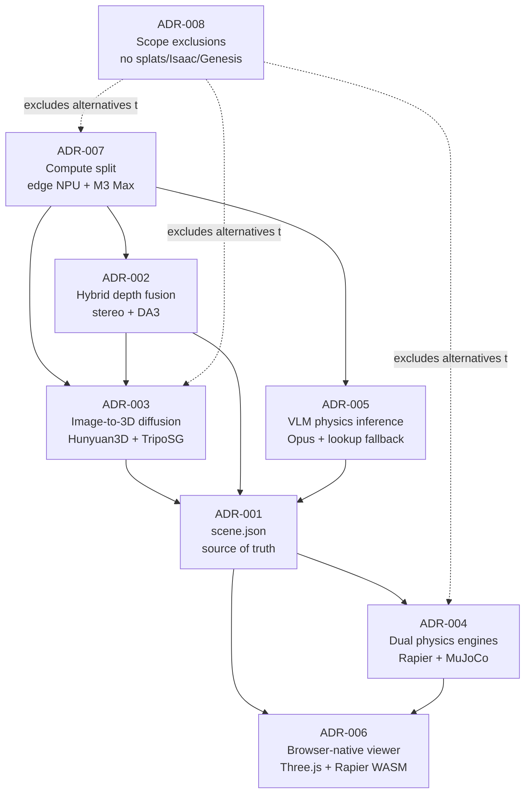

# VID2SIM Architecture Decision Records

This directory holds the Architecture Decision Records (ADRs) for the VID2SIM hackathon project. VID2SIM turns an RGB-D capture from a Luxonis OAK-4 D / D Pro camera into a browser-playable, physics-ready 3D scene using on-device perception, monocular-depth fusion, image-to-3D diffusion, and VLM-inferred physics properties. Full product context lives in the PRD at [`../VID2SIM_PRD.md`](../VID2SIM_PRD.md). Each ADR below records a single decision the team locked in at project kickoff on 2026-04-18.

## Index

| #   | Title                                                                 | Status   | Date       | Area                          |
| --- | --------------------------------------------------------------------- | -------- | ---------- | ----------------------------- |
| 001 | [Custom JSON scene spec as source of truth](ADR-001-scene-spec-source-of-truth.md) | Accepted | 2026-04-18 | Data model / interchange      |
| 002 | [Hybrid stereo + monocular depth fusion](ADR-002-hybrid-depth-fusion.md)           | Accepted | 2026-04-18 | Perception (Stage A)          |
| 003 | [Hunyuan3D 2.1 for geometry completion, TripoSG 1.5B fallback](ADR-003-image-to-3d-diffusion.md) | Accepted | 2026-04-18 | Geometry completion (Stage B) |
| 004 | [Split physics engines (Rapier browser, MuJoCo export)](ADR-004-dual-physics-engine.md) | Accepted | 2026-04-18 | Physics runtime (Stage D)     |
| 005 | [VLM-inferred physics properties with lookup fallback](ADR-005-vlm-physics-inference.md) | Accepted | 2026-04-18 | Physics inference (Stage C)   |
| 006 | [Browser-native viewer, no backend](ADR-006-browser-native-viewer.md)              | Accepted | 2026-04-18 | Demo delivery                 |
| 007 | [Compute split — edge NPU for perception, M3 Max for offline](ADR-007-compute-split.md) | Accepted | 2026-04-18 | Compute placement             |
| 008 | [Scope exclusions (no splats, Isaac, Genesis, video diffusion)](ADR-008-scope-exclusions.md) | Accepted | 2026-04-18 | Scope / risk                  |

## Relationships



Reading it left-to-right: the compute split (007) enables both the hybrid perception stack (002) and the offline diffusion + VLM stages (003, 005). Those stages feed the `scene.json` source of truth (001), which fans out to the dual physics engines (004) and the browser viewer (006). ADR-008 is the scope fence that rules out the main alternatives considered in 003, 004, and 007.

## ADR Template

All ADRs in this directory follow the template below. Keep each ADR under 200 lines.

```markdown
# ADR-NNN: Short imperative title

- **Status:** Proposed | Accepted | Deprecated | Superseded by ADR-XXX
- **Date:** YYYY-MM-DD
- **Deciders:** <names or roles>
- **Area:** <area of the system>

## Context

What is the forcing function? What constraints (hardware, time, team) matter here?
Link to the PRD section(s) that motivate this decision.

## Decision

The decision, stated in one or two paragraphs. Imperative voice.

## Alternatives Considered

- **Alternative A.** Why rejected.
- **Alternative B.** Why rejected.
- **Alternative C.** Why rejected.

## Consequences

**Positive**
- What gets better.

**Negative**
- What gets worse or what we now carry.

**Neutral**
- Implications that are neither clearly good nor bad.

## References

- PRD section(s)
- Related ADRs
- External links (papers, docs, benchmarks)
```

## How to add a new ADR

1. Copy the template above into a new file named `ADR-NNN-short-kebab-title.md`, where `NNN` is the next unused three-digit number (check the index table).
2. Fill in Context, Decision, Alternatives Considered, Consequences, and References. Keep it under 200 lines.
3. Set Status to `Proposed` until the team accepts it; then update to `Accepted` with the acceptance date.
4. Add a new row to the index table above, in numerical order.
5. Update the Relationships diagram if the new ADR depends on or supersedes an existing one.
6. If the new ADR supersedes an older one, set the older ADR's Status to `Superseded by ADR-NNN` and add a reference line.
